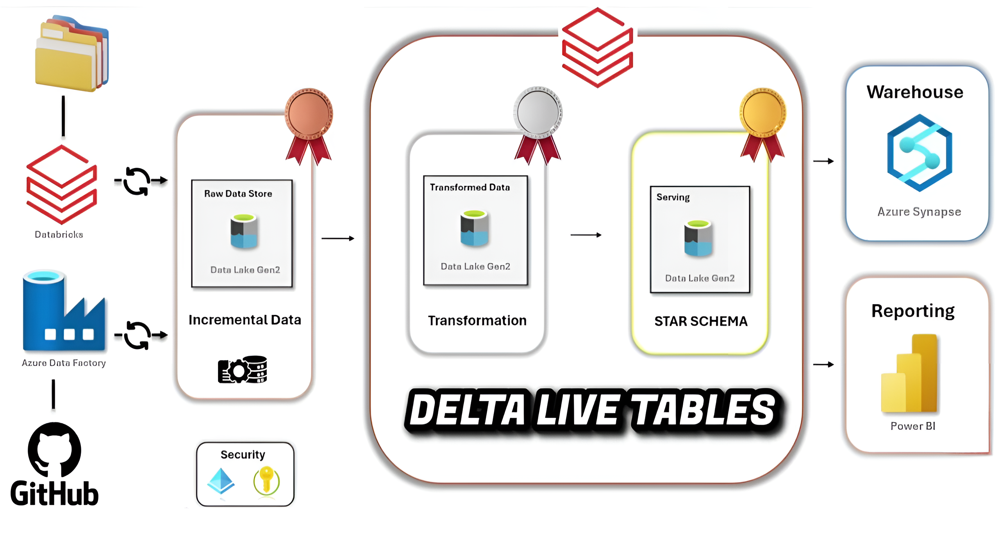

# Netflix DataOps Pipeline with Azure & Delta Live Tables

## Introduction

This project is a comprehensive end-to-end Azure Data Engineering solution designed for 2025, aimed at handling real-time, large-scale data processing using the **Netflix dataset**. It focuses on building a modern data pipeline leveraging Delta Live Tables (DLT) within the Medallion architecture pattern and covers ingestion, transformation, orchestration, storage, and reporting.

## Project Overview

This project demonstrates a complete **end-to-end data engineering pipeline** on Azure using the **Netflix dataset** as the primary source for demonstrating real-world data workflows.

Stack includes:

- **Azure Data Factory** for orchestrating ingestion  
- **Azure Data Lake Gen2** for raw and transformed storage  
- **Databricks (Delta Live Tables)** for ETL and transformations  
- **Azure Synapse Analytics** as a serving data warehouse  
- **Power BI** for data visualization and reporting  
- **GitHub** for source control  
- **Azure AD & Key Vault** for security

Designed with **incremental data loads**, **modular transformations**, and a **star schema** model for reporting.

## Architecture Overview

### 1. **Data Ingestion**
- Source data (Netflix dataset) is version-controlled using **GitHub**
- **Azure Data Factory (ADF)** triggers ingestion pipelines
- Data is ingested incrementally and stored in **Azure Data Lake Gen2** (Raw Zone)
- **Security** managed through **Azure Key Vault** and **Azure Active Directory (AAD)**

### 2. **Data Transformation – Bronze → Silver → Gold**
Using **Databricks + Delta Live Tables**, data flows through 3 layers:

- **Bronze (Raw Data Store)**:
  - Ingested as-is from ADF into Data Lake
  - Minimal processing or schema enforcement

- **Silver (Transformed Data)**:
  - Cleansed and transformed using **PySpark**
  - Handles joins, filters, business logic
  - Stored in Data Lake as structured Delta tables

- **Gold (Serving Layer)**:
  - Final data is modeled in a **Star Schema**
  - Optimized for analytics and reporting

All tables are managed by **Delta Live Tables (DLT)** with auto-managed lineage, monitoring, and versioning.

## Technologies Used

| Component            | Tool/Service               |
|---------------------|----------------------------|
| Ingestion           | Azure Data Factory (ADF)   |
| Storage             | Azure Data Lake Gen2       |
| Processing          | Azure Databricks           |
| Transformation      | Delta Live Tables (DLT)    |
| Modeling            | Star Schema Design         |
| Serving Warehouse   | Azure Synapse Analytics    |
| Reporting           | Power BI                   |
| Version Control     | GitHub                     |
| Security            | Azure AD + Key Vault       |

## Dataset Used
This project utilizes the **Netflix Movies and TV Shows Dataset**, which contains metadata about titles available on Netflix. The dataset includes information such as title, genre, cast, director, country, release year, rating, and date added to the platform.

Here is the dataset used: https://github.com/amaanalimohd/netflix-azure-pipeline/tree/main/data

### **More Info About Dataset**
- **Original Data Source:** [Kaggle – Netflix Movies and TV Shows Dataset](https://www.kaggle.com/datasets/shivamb/netflix-shows)

## Data Flow Summary

1. **GitHub** → version-controlled Netflix dataset and scripts  
2. **ADF** → triggers incremental load from source  
3. **Data Lake Gen2 (Raw)** ← data lands here  
4. **Databricks DLT (Bronze)** → minimal formatting  
5. **DLT (Silver)** → transformation logic applied  
6. **DLT (Gold)** → star schema tables ready for analytics  
7. **Azure Synapse** → warehouse layer for reporting  
8. **Power BI** → dashboards connect to Synapse  

## Security Practices

- **Secrets & Keys** stored in **Azure Key Vault**
- **Access Control** via **Azure Active Directory**
- Role-based access to Lakehouse zones (bronze, silver, gold)

## Reporting & Dashboards

- **Power BI** dashboards are connected to **Azure Synapse**
- Uses star schema tables for optimized DAX and visuals
- Scheduled refresh for near real-time reporting

## Benefits of Using Delta Live Tables

- Built-in **lineage tracking** and **data quality checks**
- **Auto-scaling**, **versioning**, and **error handling**
- **Streaming or batch** ingestion supported
- Supports **CDC (Change Data Capture)** and **schema evolution**

## Key Learnings

- Implemented an enterprise-grade Azure data architecture.
- Hands-on experience with Delta Live Tables and Medallion design.
- Built scalable ETL pipelines using ADF and Databricks.
- Star schema modeling for business analytics.
- Configured secure access using Key Vault and RBAC.
- Developed interactive dashboards in Power BI.
- Integration of on-prem and cloud data sources.
---

### 📢 **If you find this project helpful, consider giving it a ⭐ on GitHub!** 🚀
